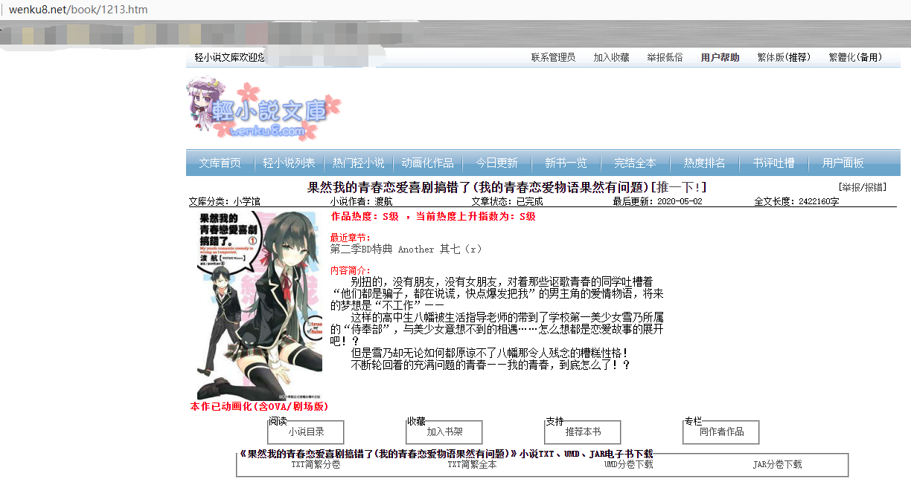

轻小说文库爬虫/下载器
=======================================================

用来方便的下载[www.wenku8.net](http://www.wenku8.net)站点下的轻小说

#### 使用方式

1. Node执行环境
2. `git clone https://github.com/Messiahhh/Wenku8-Crawler.git `
3. ` cd Wenku8-Crawler && npm install `
4. 根目录下存在名为`novels`的文件夹
5. 修改`app.js`的cookie变量为你自身的cookie
6. 修改`app.js`的`Novel.download`函数的参数为想要下载的小说的目录页地址，如下图



7. `node app.js`会自动下载本小说的全部章节，文件格式默认为`md`


##### 核心调度算法

``` js
class Scheduler {
	constructor(count) {
		this.count = count
		this.queue = []
		this.run = []
	}

	add(task) {
		this.queue.push(task)
		return this.schedule()
	}

	schedule() {
		if (this.run.length < this.count && this.queue.length) {
		  	const task = this.queue.shift()
		  	const promise = task().then(() => {
		  		this.run.splice(this.run.indexOf(promise), 1)
		  	})
		  	this.run.push(promise)
		  	return promise
		} else {
		  	return Promise.race(this.run).then(() => this.schedule())
		}
	}
}
let scheduler = new Scheduler(50)

scheduler.add(async () => {
    let $$ = await this.get(url)
    return fs.writeFileAsync('')
}).then(() => {
    
})
```


##### 技术栈

**axios, cheerio, iconv-lite**