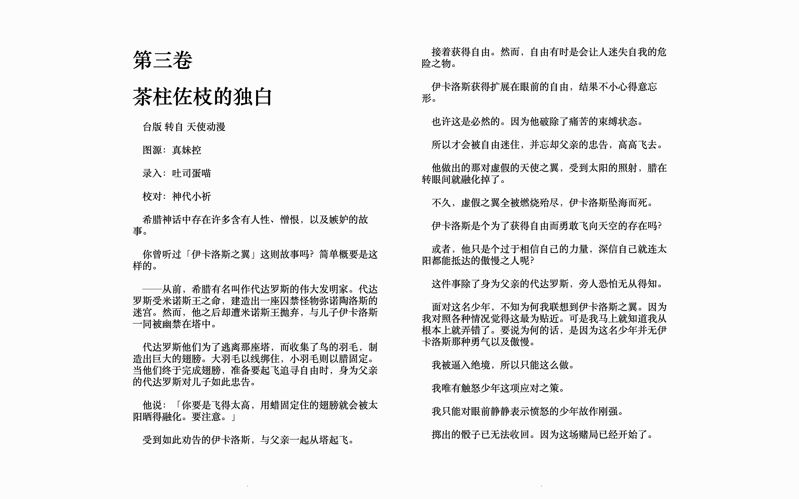

轻小说文库下载器
=======================================================


## 介绍

本工具可用来下载[轻小说文库](https://www.wenku8.net/index.php)的小说，支持以下功能

- 支持根据小说名、作者名进行搜索
- 支持生成*epub*格式的电子书（默认行为）
- 支持生成*markdown*文件
- 支持仅下载小说插图
- 支持下载轻小说文库站点已下架的小说，如《无职转生》


## 安装

本工具基于Node.JS实现，请确保安装了[Node环境](https://nodejs.org/en/)

### 全局安装（推荐）

``` shell
npm install wenku8 -g # yarn global add wenku8
wenku8 
```


### 本地安装

``` shell
npm install wenku8 -D # yarn add wenku8 -D
npx wenku8
```


## 使用方式

### 方式一、生成epub电子书（默认行为）

``` shell
wenku8
```





### 方式二、下载Markdown文件以及插图

``` shell
wenku8 --no-epub
```


### 方式三、仅下载小说插图

``` shell
wenku8 --no-epub --onlyImages
```


## 本地调试

``` shell
git clone https://github.com/Messiahhh/wenku8-downloader.git
cd wenku8-downloader
npm install

npm start
npm start -- --no-epub
npm start -- --no-epub --onlyImages
```


## 贡献者

<a href="https://github.com/Messiahhh/wenku8-downloader/graphs/contributors">
  
</a>


