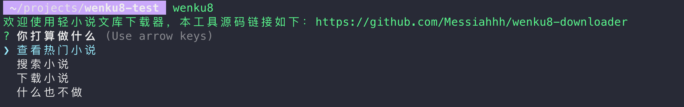
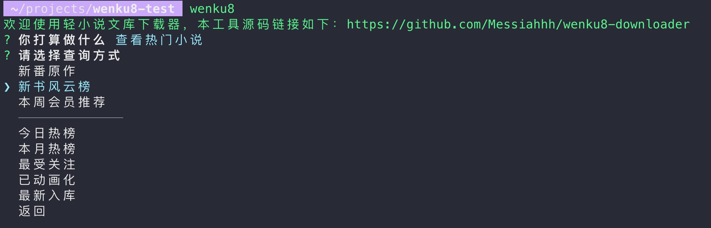
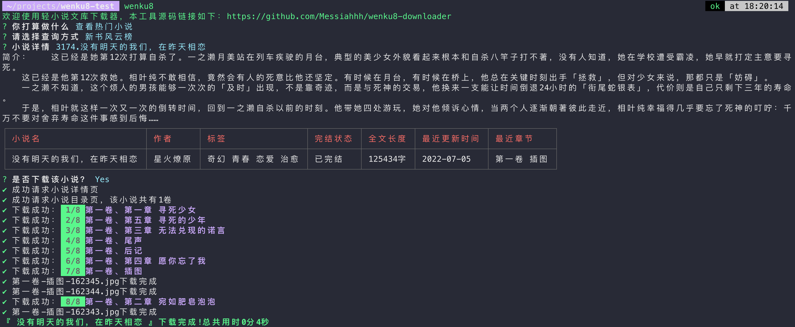
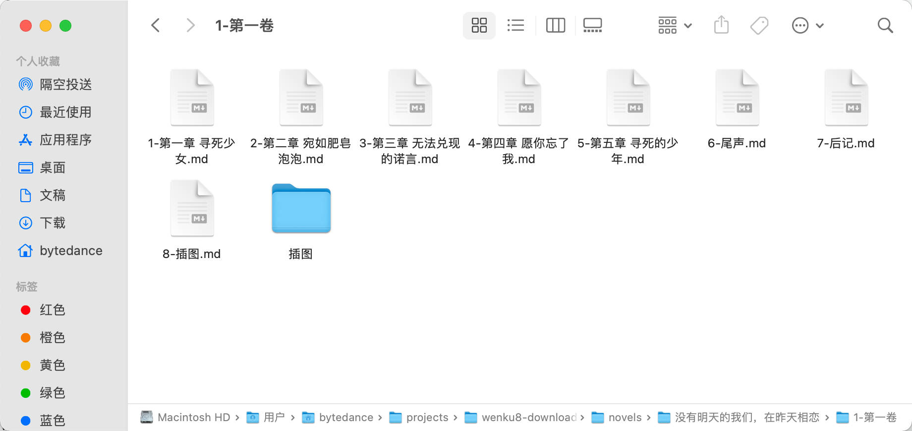
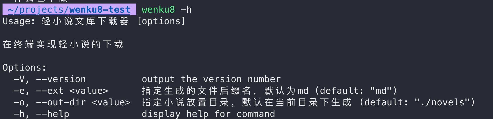

轻小说文库下载器
=======================================================

## 介绍

用于下载[轻小说文库](https://www.wenku8.net/index.php)的小说，支持搜索功能、支持已下架小说的下载，如无职转生


## 安装

需要[NodeJs环境](https://nodejs.org/en/)

### 全局安装

``` shell
npm install wenku8 -g # yarn global add wenku8-downloader 
wenku8 
```


### 本地安装

``` shell
npm install wenku8 -D # yarn add wenku8-downloader -D
npx wenku8
```


## 使用










## 自定义




## 贡献者

<a href="https://github.com/Messiahhh/wenku8-downloader/graphs/contributors">
  
</a>

